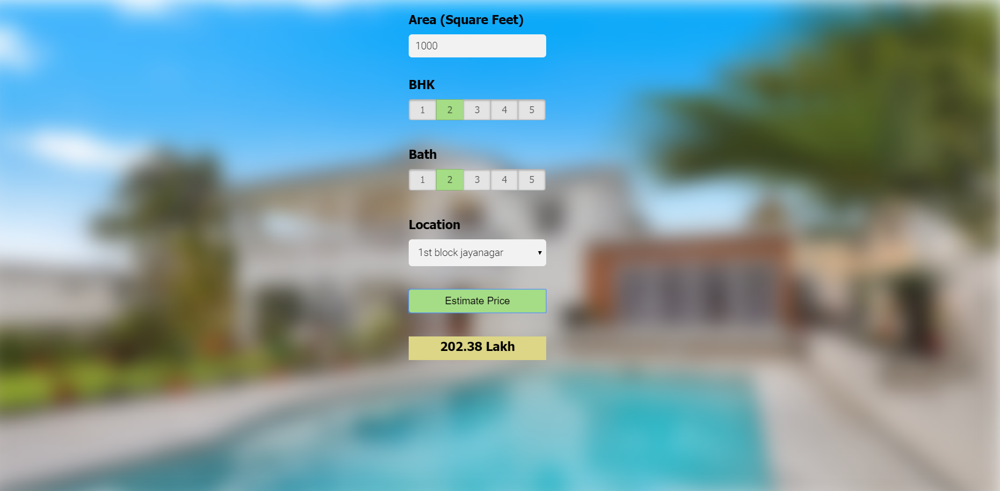

# Website page screenshot

# Steps involved 
1. Building model using sklearn and linear regression using bangalore home prices dataset from kaggle.com
2. Writing a python flask server that uses the saved model to serve http requests
3. Building website in html, css and javascript that allows user to enter home square ft area, bedrooms etc and it will call python flask server to retrieve the predicted price

# Technology and tools used in this project
1. Python
2. Numpy and Pandas for data cleaning
3. Matplotlib for data visualization
4. Sklearn for model building
5. Jupyter notebook, visual studio code and pycharm as IDE
6. Python flask for http server
7. HTML/CSS/Javascript for UI

# Website link
http://ec2-3-133-88-210.us-east-2.compute.amazonaws.com

